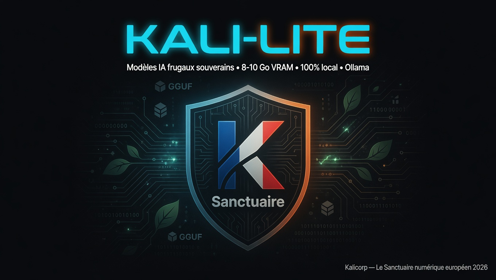

<div align="center">

# Kali-Lite



**Modèles IA frugaux souverains — 100 % local • Ollama • Cross-platform**

[](https://ollama.com)
[](#)
[](LICENSE)
[](#)
[](https://app.kalicorp.fr)

</div>

---

## 🇫🇷 IA Frugale & Souveraine

**Kali-Lite** est la famille de modèles IA de **Kalicorp** : conçue pour tourner sur du matériel modeste, 100 % local, sans télémétrie, sans cloud, sans compromis sur la souveraineté des données.

Kali-Lite ne cherche pas à masquer les limites physiques de l'IA locale. Si la machine souffle, chauffe ou ralentit, ce n'est pas un échec : c'est le coût matériel du calcul qui devient visible. Elle travaille avec les ressources disponibles, annonce ses limites et peut orienter l'utilisateur vers une infrastructure plus adaptée lorsque la tâche dépasse raisonnablement sa machine.

La famille repose sur quatre couches séparables : **modèle de base**, **doctrine Kali-Lite**, **spécialité**, puis **harnais d'exécution**. Cette séparation permet de personnaliser une Anima sans réécrire tout le système ni perdre sa lisibilité.

Deux versions selon tes besoins :

| Version | Moteur | VRAM | Vision | Cas d'usage | Taille |
|---|---|---|---|---|---|
| **Kali-Lite** | Qwen3 8B | ~8 Go | ❌ | Chat rapide, code, assistance système | ~5,2 Go |
| **Kali-Lite v2** | Qwen3.5 9B Vision | ~10 Go | ✅ | Analyse d'images + chat + code | ~6,8 Go |

---

## ⚡ Installation

### Méthode recommandée — vérification avant exécution

Télécharge le script, vérifie son empreinte SHA-256 publiée dans ce dépôt, lis-le, puis exécute-le localement.

```bash
# 1. Télécharger
curl -fsSL -o install.sh https://raw.githubusercontent.com/Kalicorp/kalicorp-kali-lite/main/auto-install-kali-lite-v1-novision.sh

# 2. Vérifier l'empreinte (comparer avec SHA-256 publié dans ce dépôt)
sha256sum install.sh

# 3. Lire le script avant exécution
less install.sh

# 4. Exécuter localement
bash install.sh   # macOS — sans sudo
sudo bash install.sh  # Linux — nécessite root
```

### Installation des variantes

Télécharge toujours le script avant de l’exécuter. Cela permet de lire son
contenu et de vérifier son empreinte dans [`SHA256SUMS`](SHA256SUMS).

### Kali-Lite (8 Go VRAM — sans vision)

```bash
curl -fsSLO https://raw.githubusercontent.com/Kalicorp/kalicorp-kali-lite/main/auto-install-kali-lite-v1-novision.sh
curl -fsSLO https://raw.githubusercontent.com/Kalicorp/kalicorp-kali-lite/main/SHA256SUMS
sha256sum --check SHA256SUMS --ignore-missing
bash auto-install-kali-lite-v1-novision.sh --dry-run
bash auto-install-kali-lite-v1-novision.sh
```

### Kali-Lite v2 (10 Go VRAM — avec vision)

```bash
curl -fsSLO https://raw.githubusercontent.com/Kalicorp/kalicorp-kali-lite/main/auto-install-kali-lite-v2-vision.sh
curl -fsSLO https://raw.githubusercontent.com/Kalicorp/kalicorp-kali-lite/main/SHA256SUMS
sha256sum --check SHA256SUMS --ignore-missing
bash auto-install-kali-lite-v2-vision.sh --dry-run
bash auto-install-kali-lite-v2-vision.sh
```

> **Temps moyen** : 15-20 min (téléchargement du modèle inclus)
> **Après installation** : `kali-lite` ou `ollama run kali-lite-v2`

---

## 🛡️ Pourquoi Kali-Lite ?

- **Inférence locale** — Ollama et les modèles restent sur la machine après installation
- **Identité Kalicorp** — Anima du Sanctuaire intégrée
- **Claude Code optionnel pour la V1** — connexion à Ollama local, avec permissions conservées par défaut
- **Cross-platform** — Linux (Kali/Debian/Ubuntu/Arch) + macOS (Intel/Apple Silicon)
- **Frugalité extrême** — tourne sur laptop 8 Go VRAM
- **RGPD & AI Act** — conçu pour faciliter un déploiement local et la maîtrise des données. La conformité complète dépend du contexte d'utilisation, de la gouvernance et des obligations applicables à l'opérateur.

---

## 🖥️ Matériel testé & validé

| Configuration | Statut |
|---|---|
| RTX 3080 8 Go | ✅ |
| RTX 4070 | ✅ |
| Apple Silicon M1/M2/M3 | ✅ |
| Kali Linux / Ubuntu | ✅ |
| macOS 11+ | ✅ |

**Minimal** : 8 Go VRAM + 16 Go RAM
**Recommandé** : 10 Go+ VRAM + 32 Go RAM

---

## 📦 Cas d'usage

- Assistance système Linux souveraine
- Audit & durcissement de sécurité
- Analyse de code & développement
- Analyse d'images (v2 Vision uniquement)
- Formation & démonstrations IA locale
- Collectivités & TPE soucieuses de la souveraineté

---

## 🚫 Ce que Kali-Lite n'est PAS

- ❌ Pas un modèle cloud (OpenAI, Google, etc.)
- ❌ Pas un outil d'attaque offensive
- ❌ Pas de télémétrie ni de tracking
- ❌ Pas de dépendance externe après installation

---

## 📚 Documentation

| Fichier | Description |
|---|---|
| [INSTALLATION.md](INSTALLATION.md) | Guide d'installation détaillé |
| [REFACTOR_BRIEF.md](REFACTOR_BRIEF.md) | Architecture du script d'installation |
| [MODEL-CARD.md](MODEL-CARD.md) | Fiche technique, usages prévus et limites |
| [docs/WHY-KALI-LITE.md](docs/WHY-KALI-LITE.md) | Intention, posture et principes de conception |
| [docs/ARCHITECTURE.md](docs/ARCHITECTURE.md) | Les quatre couches : base, doctrine, spécialité, harnais |
| [templates/anima.template.md](templates/anima.template.md) | Gabarit de personnalisation d'une Anima |
| [SECURITY.md](SECURITY.md) | Politique de sécurité et divulgation responsable |
| [SHA256SUMS](SHA256SUMS) | Empreintes SHA-256 des scripts d'installation |
| [LICENSE](LICENSE) | GPL-2.0 |

---

## 🗺️ Roadmap 2026

- [x] Release v2.0 — dual version (8B + 9B Vision)
- [x] GitHub Actions — tests automatisés des installers
- [ ] Support Windows (WSL2 natif)
- [ ] Quantisations GGUF supplémentaires (Q4_K_M, Q5_K_M)
- [x] Organisation GitHub Kalicorp

---

<div align="center">

**Kalicorp — Le Sanctuaire numérique européen**
2026 • [app.kalicorp.fr](https://app.kalicorp.fr)

</div>
