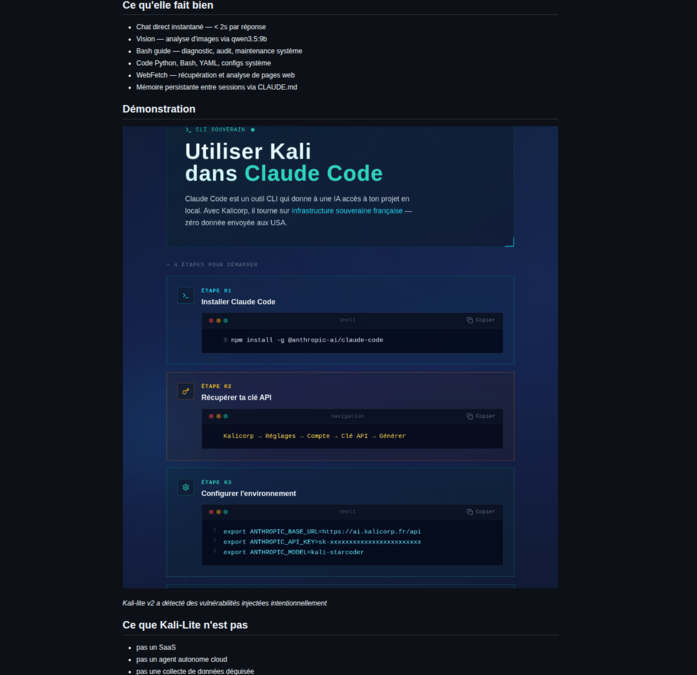

# kalicorp-hardening — Kali-lite v2

**LLM local multi-rôle — CLI & chatbot souverain**

Kali-Lite v2 est un LLM local multi-rôle — CLI et chatbot souverain — conçu pour travailler au plus près du système, sans déplacer vos données, vos habitudes ou votre environnement.

## Architecture

- **Moteur** : qwen3.5:9b (vision, custom local) via Ollama
- **Interface** : Claude Code v2+ — proxy Ollama local au format API Anthropic
- **Identité** : gravée dans un Modelfile + CLAUDE.md
- **Données** : sur site uniquement — aucune extraction
- **API** : `ANTHROPIC_BASE_URL=http://localhost:11434`

## Installation

```bash
curl -fsSL https://raw.githubusercontent.com/balduregates1/kalicorp-hardening/main/install.sh | bash
```

~20 min. ~10 Go VRAM recommandés — 8 Go possibles avec contraintes selon usage.

## Configurations

| Config | GPU VRAM | RAM | CPU | OS |
|---|---|---|---|---|
| Minimale | 8 Go | 16 Go | 6 cœurs | Ubuntu 22.04+ |
| Recommandée | 8 Go+ | 32 Go | 8 cœurs+ | Kali / Debian |
| Testée | 8 Go RTX 3080 | 64 Go | i7-10750H 6c/12t | Kali Linux 6.18 |
| macOS | 8 Go+ (Metal) | 16 Go | Apple Silicon / Intel | macOS 11+ |

## Cas d'usage

- environnement IA local pour développeurs
- assistance système et diagnostic Linux
- analyse d'images locale
- workflow Claude Code souverain
- poste IA compatible RGPD / AI Act
- laboratoire IA personnel ou PME

## Ce qu'elle fait bien

- Chat direct instantané — < 2s par réponse
- Vision — analyse d'images via qwen3.5:9b
- Bash guide — diagnostic, audit, maintenance système
- Code Python, Bash, YAML, configs système
- WebFetch — récupération et analyse de pages web
- Mémoire persistante entre sessions via CLAUDE.md

## Démonstration



*Kali-lite v2 a détecté des vulnérabilités injectées intentionnellement*

## Ce que Kali-Lite n'est pas

- pas un SaaS
- pas un agent autonome cloud
- pas une collecte de données déguisée
- pas une surcouche marketing
- pas une IA qui remplace votre environnement de travail

Kali-Lite travaille avec votre système.
Pas à sa place.

## Licence

GPL-2.0 — redistribution autorisée.

## Cadre — conformité RGPD / AI Act

Conçu pour faciliter la conformité RGPD / AI Act.

Kalicorp | Le Sanctuaire, Sissonne | 2026 | app.kalicorp.fr
